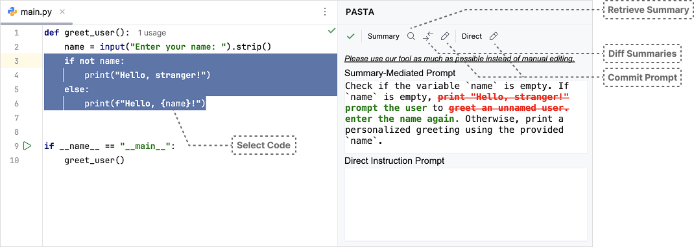

# PASTA: Prompting-Based Code Modification Plugin for JetBrains IDEs

PASTA (**P**rompt-**A**ssisted **S**oftware **T**r**A**nsformation) is a research prototype plugin for JetBrains IDEs (e.g., PyCharm, WebStorm) designed to investigate how developers use different prompting techniques for real-world code modification tasks. PASTA supports both summary-mediated and direct instruction prompting, providing an environment for empirical studies of LLM-assisted code editing.

    

## Features & Workflow

- **Selection-Based Prompting**: Select code in the editor to specify the target for modification.
- **Summary-Mediated Prompting**: Generate a concise, editable summary (1–3 sentences) of the selected code. Edit the summary to express the intended change, and view before/after summary differences to aid revision.
- **Direct Instruction Prompting**: Alternatively, write a free-form natural language command describing the desired modification.
- **Commit & Review**: Submit your prompt (summary or instruction) to the LLM. The plugin displays the resulting code changes in a diff view with line- and token-level highlights for inspection and selective acceptance.
- **Context Inclusion**: The full content of the current file is always included as context in LLM requests.

## Implementation

- Built with the [IntelliJ Platform Plugin SDK](https://plugins.jetbrains.com/docs/intellij/welcome.html), compatible with all JetBrains IDEs.
- Uses [Java Diff Utils](https://java-diff-utils.github.io/java-diff-utils/) for summary comparison and the JetBrains SDK's diff package for code changes.
- LLM integration via [OpenAI GPT-4o](https://openai.com/index/hello-gpt-4o/) chat completions API, with few-shot examples for consistency.
