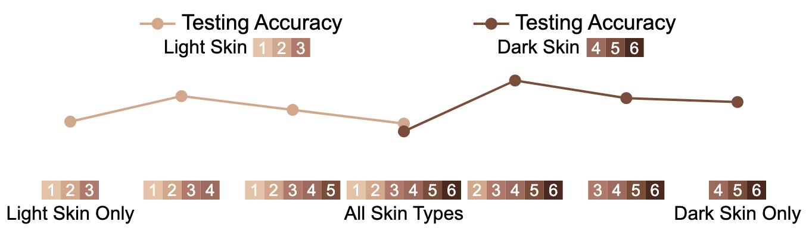

# Task 2: D3.js LineGraph

**You have 20 minutes start from now to complete the following tasks.**

## Background

This project is a D3.js-based line graph visualization designed to evaluate the impact of training data composition on fairness in machine learning models. The visualization presents testing accuracy across different training sets, highlighting potential biases in model performance.

Specifically, it compares the performance of models trained on datasets with different skin type distributions by testing them separately on light and dark skin samples.
- The skin types are ranging from 1 to 6, with 1 being the lightest and 6 being the darkest.
- The X-axis represents the training set, i.e., the skin types used for training.
- The Y-axis represents the testing accuracy, separated into light skin testing accuracy (left, light color) and dark skin testing accuracy (right, dark color).

## Current & Expected Output

**Please pay attention to the difference between the current and expected figures.**

This is the **current** output of the line graph.

    

    

## Modification Requirements

*The visualization output is displayed in the browser and will be automatically updated when you make changes to the code. The reference code location is provided in parentheses for your reference.*

**1. Label Accuracy Values Directly** (`drawAccuracyPoints` function)
- Instead of using a y-axis, place the **exact accuracy values** (e.g., 48%) near the data points
- **Light skin** and **dark skin** accuracy values should be displayed **above** and **below** the corresponding points, respectively.

**2. Beautify X-Axis Markers** (`drawTrainingMarkers` function)
- Split the single-row markers into two rows: The first row should contain 1, 2, 3. The second row should contain 4, 5, 6.
- Any skin type that was not used for training should be displayed in gray (`#ddd`).