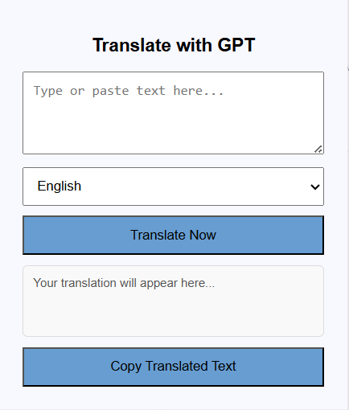
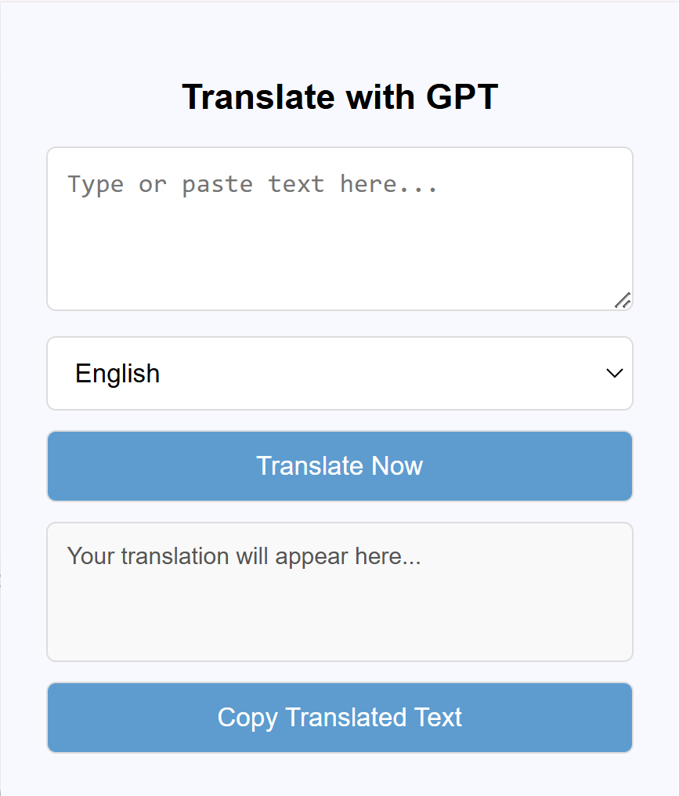

# Task 3: GPT Translator

**You have 20 minutes start from now to complete the following tasks.**

## Background

This project is a simple Chrome extension that allows users to translate input text into a target language using OpenAI's GPT-4o.

*The icon is generated by DALL-E in GPT-4o using the prompt: "A simple, black-and-white line art icon representing translation. The design should feature two speech bubbles or document icons, one with a non-Latin character."*

## Current & Expected Output

The left image is the **current** interface of the translator, which we have loaded in the browser.

The right image is the **expected** interface. You can also interact with the expected interface in Chrome browser to see the difference.

    
    

  

## Modification Requirements

*The frontend will automatically update when you click the popup button again. However, each time `background.js` is modified, the plugin should be reloaded from `chrome://extensions/`. You can right-click the popup and select "Inspect" to view the console log. The reference code location is provided in parentheses for your reference.*

**1. Click Effects for the Copy Button** (`popup.js`)
- When the **Copy** button is clicked, except for copying the translated text to the clipboard, also:
  - Temporarily change the button text to **"Copied to Clipboard!"**.  
  - After **2 seconds**, revert the text back to **"Copy Translated Text"**.

**2. Improve UI Styling** (`style.css`)
- **Apply consistent styling to `textarea`, `select`, `button`, `input`**:  
  - Round the corners of the elements in 5px.
  - The border of the elements is 1px wide and solid, and the color is #ddd.
- **Style buttons separately**:  
  - The font color is pure white.
  - When mouse hovers over the button, the cursor changes from triangle pointer to hand👆.

**3. Add More Language Options & Ensure Proper Language Translation** (`popup.html`, `popup.js`, `background.js`)
- Expand the dropdown menu in `popup.html` to include **English, Chinese, French, and a Custom Language** option.
- Modify `popup.js` so that when the `translateButton` is clicked, it passes the selected target language to `background.js`.
- Update `background.js` to adjust the **GPT prompt** to set the target language as the selected language.