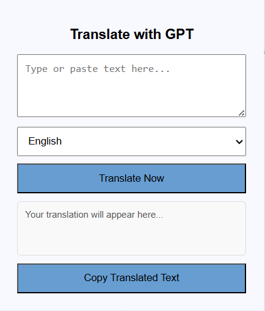
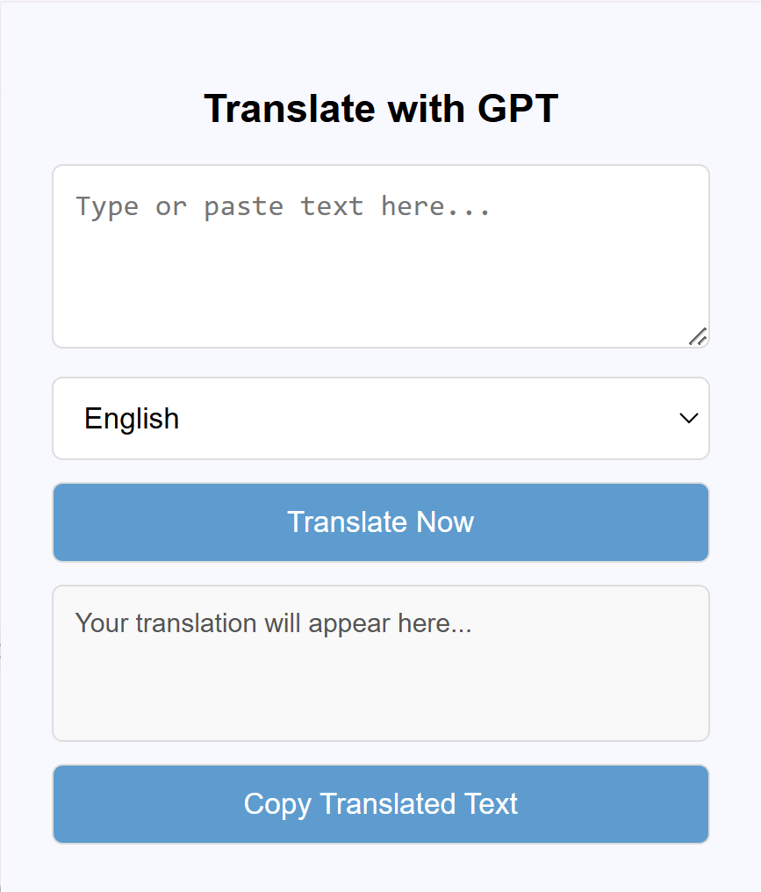

# Task 0: Python Greeting (Demonstration Example)

**You have 5 minutes start from now to complete the following tasks.**

## Background

This is a simple Python program that greets the user. We use it to demonstrate how to use the two prompting techniques to modify the code.

## Modification Requirements

*The reference code location is provided in parentheses for your reference.*

**1. Empty Name Handling** (`greet_user` function)

- If the user enters an empty name, the program should notify the user about the emptiness, and prompt again to enter their name.

**2. Multiple Greetings** (`greet_user` function)

- Add a `times` parameter to control the number of greetings, with a default value of three.

# Task 1: TensorFlow Autoencoder

**You have 20 minutes start from now to complete the following tasks.**

## Background  

This project is a Sparse Autoencoder implemented using TensorFlow and Keras. The autoencoder is designed to learn an efficient latent-space representation of MNIST images by enforcing sparsity constraints in the encoding process.

## Modification Requirements

*Note that in this task, the actual loss value and visualization vary and are not important. You just need to ensure your modifications make the code runnable. The reference code location is provided in parentheses for your reference.*

**1. Update Model Architecture** (`__init__` function of `SparseAutoencoder`)

- Change the architecture of the **encoder** and **decoder** while maintaining the fully connected structure.  
- In the **encoder**:  
  - Replace `ReLU` activation with **Leaky ReLU** with an `alpha` of **0.1** in the first dense layer.  
  - Add **Batch Normalization** after the activation to stabilize training, as well as **Dropout** with a rate of **0.2** for regularization.  
  - Change the final encoding layer activation from `sigmoid` to **tanh**.
- In the **decoder**:  
  - Use **Leaky ReLU** with an `alpha` of **0.1** instead of `ReLU`.  
  - Include **Batch Normalization** and **Dropout** with a rate of **0.2** similar to the encoder.  

**2. Use KL Divergence as Sparsity Loss** (`compute_sparsity_loss` function of `SparseAutoencoder`)

- Instead of using **L1 regularization**, compute the sparsity loss using **Kullback-Leibler (KL) divergence**.

- The KL divergence formula for each neuron should be:
  $$
  \text{KL}(\rho || \hat{\rho}) = \rho \log \frac{\rho}{\hat{\rho}} + (1 - \rho) \log \frac{1 - \rho}{1 - \hat{\rho}}
  $$
  where:

  - $\rho$ is the desired sparsity level, and should be set to **0.05**.
  - $\hat{\rho}$ is the **average activation** of each neuron across the batch.

- Sum the KL divergence over all neurons in the encoding layer and apply the sparsity penalty to the total loss.

**3. Customize Learning Rate Schedule** (`optimizer` assignment statement)

- Write a customized learning rate schedule function that uses the **Cosine Decay** instead of a fixed learning rate, with the following formula:
  $$
  \eta_t = \eta_0 \times \frac{1 + \cos\left(\frac{\pi t}{T}\right)}{2}
  $$
  where:

  - $\eta_0 = 0.001$ is the initial learning rate,
  - $t$ is the current epoch index,
  - $T = 10$ is the total number of epochs.

# Task 2: D3.js LineGraph

**You have 20 minutes start from now to complete the following tasks.**

## Background

This project is a D3.js-based line graph visualization designed to evaluate the impact of training data composition on fairness in machine learning models. The visualization presents testing accuracy across different training sets, highlighting potential biases in model performance.

Specifically, it compares the performance of models trained on datasets with different skin type distributions by testing them separately on light and dark skin samples.

- The skin types are ranging from 1 to 6, with 1 being the lightest and 6 being the darkest.
- The X-axis represents the training set, i.e., the skin types used for training.
- The Y-axis represents the testing accuracy, separated into light skin testing accuracy (left, light color) and dark skin testing accuracy (right, dark color).

## Current & Expected Output

**Please pay attention to the difference between the current and expected figures.**

This is the **current** output of the line graph.

    

    

## Modification Requirements

*The visualization output is displayed in the browser and will be automatically updated when you make changes to the code. The reference code location is provided in parentheses for your reference.*

**1. Label Accuracy Values Directly** (`drawAccuracyPoints` function)

- Instead of using a y-axis, place the **exact accuracy values** (e.g., 48%) near the data points
- **Light skin** and **dark skin** accuracy values should be displayed **above** and **below** the corresponding points, respectively.

**2. Beautify X-Axis Markers** (`drawTrainingMarkers` function)

- Split the single-row markers into two rows: The first row should contain 1, 2, 3. The second row should contain 4, 5, 6.
- Any skin type that was not used for training should be displayed in gray (`#ddd`).

# Task 3: GPT Translator

**You have 20 minutes start from now to complete the following tasks.**

## Background

This project is a simple Chrome extension that allows users to translate input text into a target language using OpenAI's GPT-4o.

*The icon is generated by DALL-E in GPT-4o using the prompt: "A simple, black-and-white line art icon representing translation. The design should feature two speech bubbles or document icons, one with a non-Latin character."*

## Current & Expected Output

The left image is the **current** interface of the translator, which we have loaded in the browser.

The right image is the **expected** interface. You can also interact with the expected interface in Chrome browser to see the difference.

    
    

  

## Modification Requirements

*The frontend will automatically update when you click the popup button again. However, each time `background.js` is modified, the plugin should be reloaded from `chrome://extensions/`. You can right-click the popup and select "Inspect" to view the console log. The reference code location is provided in parentheses for your reference.*

**1. Click Effects for the Copy Button** (`popup.js`)

- When the **Copy** button is clicked, except for copying the translated text to the clipboard, also:
  - Temporarily change the button text to **"Copied to Clipboard!"**.  
  - After **2 seconds**, revert the text back to **"Copy Translated Text"**.

**2. Improve UI Styling** (`style.css`)

- **Apply consistent styling to `textarea`, `select`, `button`, `input`**:  
  - Round the corners of the elements in 5px.
  - The border of the elements is 1px wide and solid, and the color is #ddd.
- **Style buttons separately**:  
  - The font color is pure white.
  - When mouse hovers over the button, the cursor changes from triangle pointer to hand👆.

**3. Add More Language Options & Ensure Proper Language Translation** (`popup.html`, `popup.js`, `background.js`)

- Expand the dropdown menu in `popup.html` to include **English, Chinese, French, and a Custom Language** option.
- Modify `popup.js` so that when the `translateButton` is clicked, it passes the selected target language to `background.js`.
- Update `background.js` to adjust the **GPT prompt** to set the target language as the selected language.